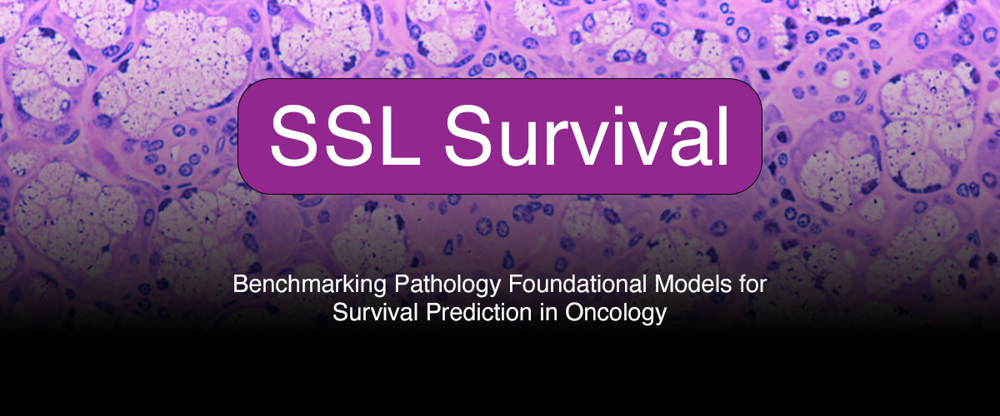

---

 
**Connect with us: https://jana-research.org/**  

We present the first large-scale benchmark of pathology foundational models for survival prediction, where their prognostic robustness is validated on external cohorts.

## About  
This repository contains the code, data splits, and results for our benchmark of nine pathology foundational models across multiple cancer types.  

## Paper

_Status: in submission_

**&#9733; We have maintained a paper list for the [pathology foundational models](document/pathology_foundational_models.md) we used in our study!**

## Acknowledgments  

This work was supported by Octopath Lab. 
We thank the maintainers of the public and private consortia and foundational models used in this benchmark.  
